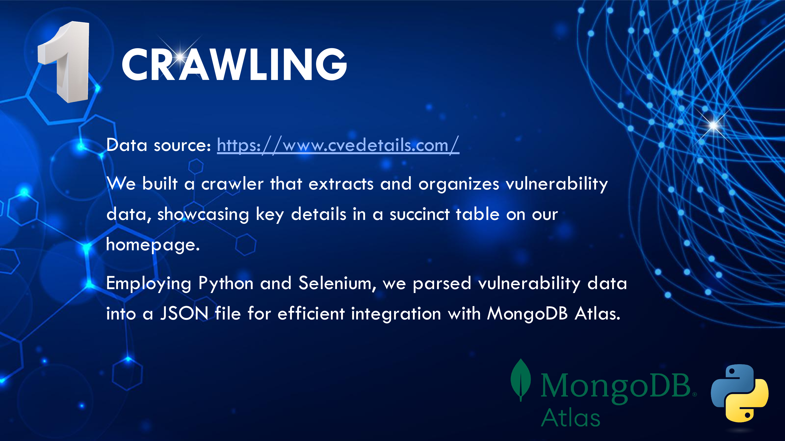
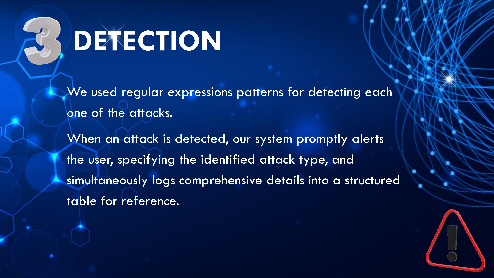
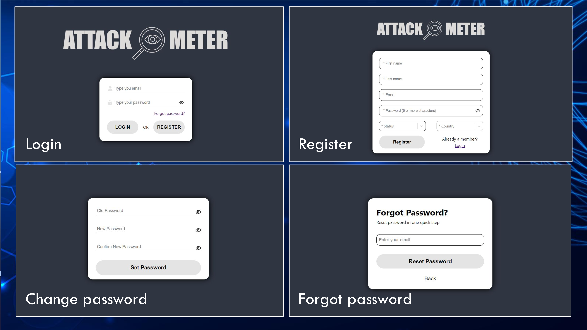
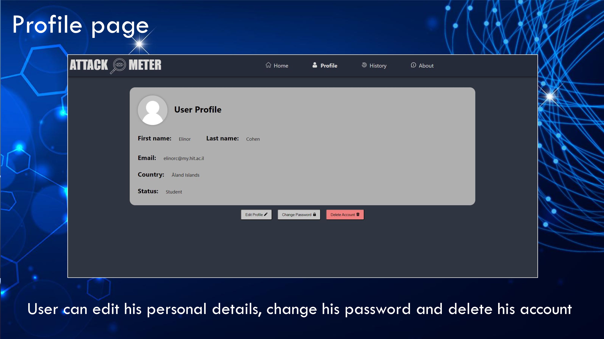
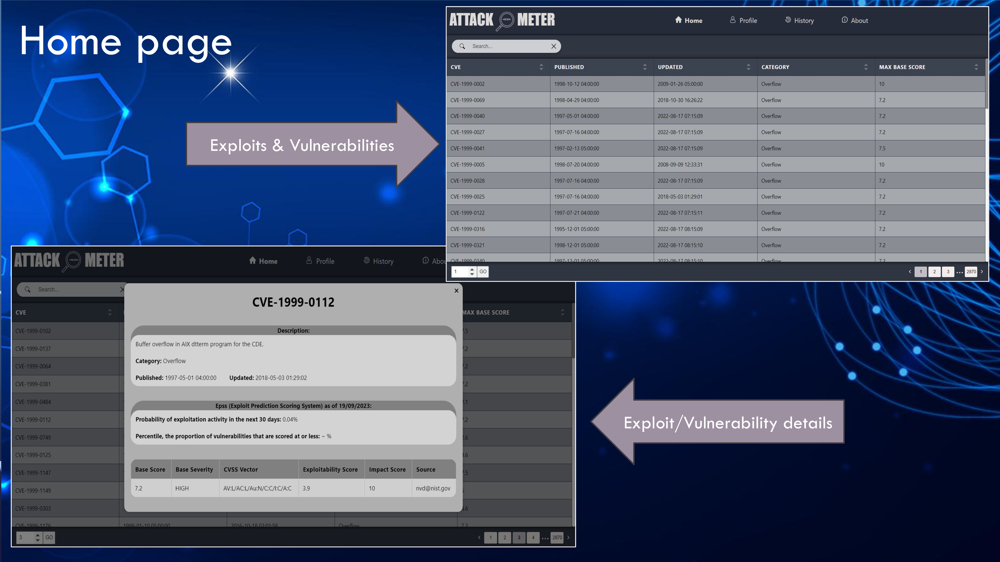
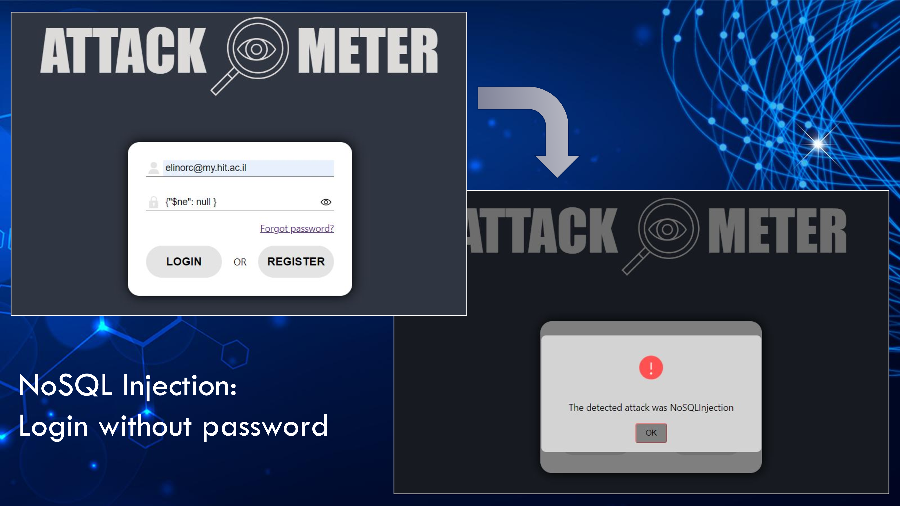

# 🛡️ Attack Meter – Web Vulnerability Simulation & Detection

## 📌 Background

Organizations face numerous security threats in the digital landscape, including cyber attacks, data breaches, and insider threats. This project addresses these threats through an educational and interactive platform.

---

## 🎯 Project Goals

- Develop a system that allows users to experiment with **XSS**, **CSRF**, and **NoSQL Injection** attacks.
- Provide automatic **recognition and detection** of common web attacks.
- Deliver a **user-friendly interface** to visualize and track detected attacks.
- Generate **attack patterns** to recognize better and categorize threats.

---

## ⚠️ Attack Types Covered

### 🔹 Cross-Site Request Forgery (CSRF)
A CSRF attack tricks a logged-in user into submitting a malicious request without their knowledge or consent.

### 🔹 Cross-Site Scripting (XSS)
An attacker injects malicious scripts that execute in the victim's browser, leading to data theft or unauthorized actions.

### 🔹 NoSQL Injection
Similar to SQL injection but targets NoSQL databases like MongoDB by injecting malicious queries to bypass authentication or access data.

---

## 🧠 Features

- 🧪 Simulated attacks via a real interface
- 🛡️ Detection and classification of threats
- 📊 History of detected attacks stored and accessible
- 👤 Full user authentication flow: login, register, reset password
- 📝 Admin dashboard & user profile management
- 🔐 Temporary password generated and hashed using **MD5** on password reset

---

## 🧱 System Architecture – 3 Phases

### 1️⃣ Crawling
- Source: [cvedetails.com](https://www.cvedetails.com)
- Python + Selenium crawler extracts vulnerabilities
- Data formatted to JSON and integrated with **MongoDB Atlas**

  

---

### 2️⃣ Development
- **Frontend**: React (Vite), with modular components & contexts
- **Backend**: Node.js + Express
- **Database**: MongoDB (via Mongoose), stored on MongoDB Atlas
- IDE: Visual Studio Code

  

---

### 3️⃣ Detection
Regular expressions are used to identify various attack patterns in real-time.

- Alerts the user about the specific type of attack.
- Logs all details in a structured format for review.

  

---

## 🖥️ UI Screenshots

### 🔐 Authentication Screens

Login, register, change password, reset password.

  

---

### 🧍‍♂️ Profile Page

Users can view and update their profile, change their password, or delete their account.

  

---

### 🏠 Home Page – CVE Dashboard

Displays a list of exploits and vulnerabilities retrieved by the crawler.

  

---

### 💥 Attack Demo – NoSQL Injection

Demonstrates a login bypass using NoSQL injection and automatic detection by the system.

  

---

## 🧰 Technologies Used

| Category   | Tech Stack                      |
|------------|----------------------------------|
| Frontend   | React, Lottie animations         |
| Backend    | Node.js, Express                 |
| Database   | MongoDB Atlas                    |
| Crawling   | Python, Selenium                 |
| Dev Tools  | Visual Studio Code               |
